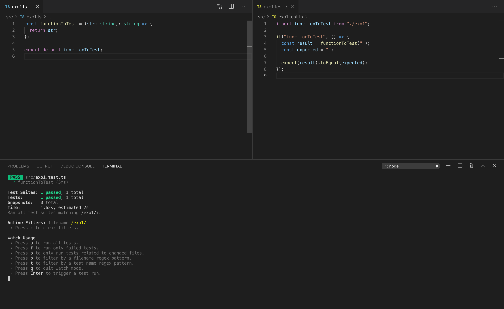

# Technical interviews (using TDD)

This repo aims at providing a simple environment to perform technical interviews using jest. It's destined for technical recruiters as well as candidates who want to practise TDD.

_Note: To technical interviewers: feel free to add any exercice and their solution (algo and tests).

## Setup

- Clone the repo `git clone`.
- Install the dependencies: `npm install`.
- Run the test you want: `npm run test exo1` or `npm run test:watch exo1`
- Good luck with the interview 🤞

